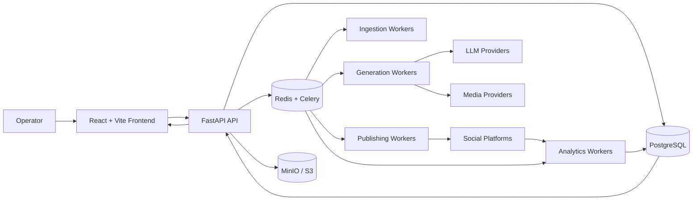
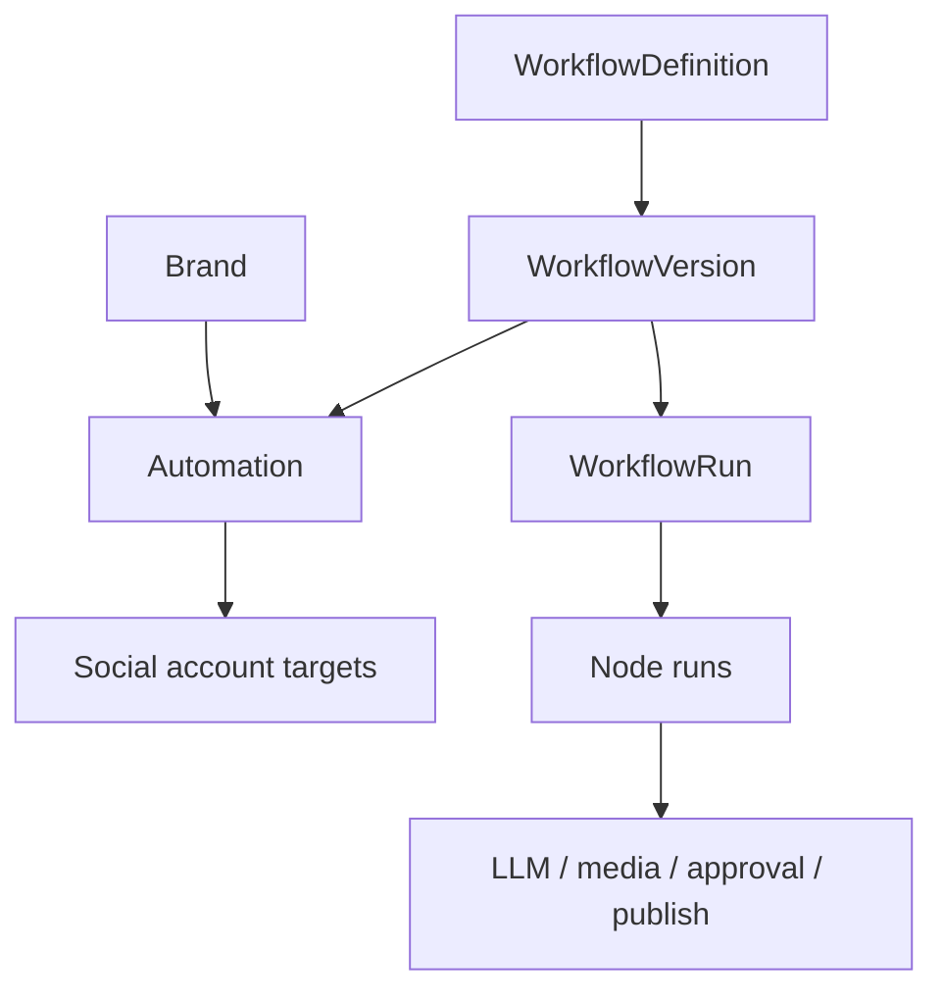

# SignalForge

AI-powered content operations platform for transforming trend signals into reviewed, platform-ready social content.

SignalForge helps teams discover emerging topics, evaluate signal quality, generate editorial briefs, create social assets, route approval workflows, and manage publishing pipelines through a unified operational dashboard.

The platform is designed for:
- content operations teams
- AI-assisted publishing workflows
- social media management
- editorial planning
- trend monitoring
- semi-autonomous content generation

Built with FastAPI, React, PostgreSQL, Redis, Celery, and modular AI provider adapters, SignalForge combines structured operational workflows with AI-assisted content production.

The system follows an approval-first architecture:
AI systems can ingest, rank, summarize, draft, and prepare content, while operators maintain control over review, approval, and publishing decisions.

---

# Core Capabilities

- Trend and signal ingestion
- Story clustering and ranking
- Editorial brief generation
- AI-assisted content generation
- Approval and review workflows
- Publishing queue management
- Analytics and feedback tracking
- Multi-provider AI routing
- Webhook and messaging integrations
- Queue-driven asynchronous processing
- Chess match video generation (PGN/SAN/UCI → 2D MP4; see [`docs/chess-video.md`](docs/chess-video.md))
- Multi-brand workflow automations (reusable DAGs → brands → accounts; see [`docs/workflows.md`](docs/workflows.md))

> Status: active development platform with production-oriented architecture and semi-autonomous publishing workflows.

---

# Why This Platform Exists

Content teams often rely on fragmented workflows across:
- trend discovery tools
- editorial planning systems
- content-generation tools
- approval channels
- publishing platforms
- analytics dashboards

SignalForge centralizes these workflows into a single operational platform designed for AI-assisted content operations.

The goal is not fully autonomous publishing.

The goal is:
- faster editorial workflows
- structured review pipelines
- reusable AI-assisted operations
- approval-controlled publishing
- scalable content generation systems

---

# Screenshots

> Add real screenshots or demo GIFs here.

| Trend Dashboard | Editorial Workflow |
|---|---|
| Add screenshot | Add screenshot |

| Content Queue | Analytics Dashboard |
|---|---|
| Add screenshot | Add screenshot |

---

# System Architecture



The backend is organized as a modular monolith with domain-based modules for ingestion, trend intelligence, editorial workflows, content generation, approvals, publishing, analytics, platform administration, and **reusable workflow automations** (versioned DAGs orchestrating those domains).

Workflow automation overview:



See [`docs/workflows.md`](docs/workflows.md) for the full model.

---

# System Design Highlights

- Modular FastAPI backend architecture
- Queue-driven asynchronous workflows
- Multi-provider AI routing
- Approval-first publishing pipeline
- Real-time job status over WebSocket
- Adapter-based media generation services
- Local-first AI provider support
- Multi-channel approval workflows
- Containerized local deployment stack

---

# Key Features

## Trend and Signal Intelligence

- RSS and feed ingestion
- Source catalog management
- Trend clustering
- Story scoring
- Trend candidate review
- Manual ingestion workflows
- Optional Google Trends-style signals

## Editorial Workflows

- Editorial brief generation
- Approve/reject workflows
- Rewrite and regenerate actions
- Brand-profile management
- Content planning workflows
- Telegram delivery support

## Content Generation

- AI-assisted content generation
- Platform-specific formatting
- Asset regeneration workflows
- Image-generation adapters
- Text-to-speech adapters
- Video-generation workflows
- Real-time job tracking

## Approval and Publishing

- Approval queues
- Telegram approval flows
- WhatsApp webhook support
- Dry-run publishing
- Retry and cancel workflows
- Connected-account validation
- Published-post tracking
- Workflow-bound approvals that pause runs without holding workers

## Workflow automations

- Versioned workflow definitions (DAG-as-data)
- Brand + multi-account automations and schedules
- Visual + step editors (`@xyflow/react`)
- Dry-run / single-node testing
- Durable run monitor with resume

## Analytics and Optimization

- Analytics synchronization
- Feedback-driven scoring
- Trend-performance review
- Publishing analytics overview
- Outcome-driven optimization workflows

## Workspace and Security

- Multi-user authentication
- Email verification
- Password reset
- MFA support
- Audit logging
- Session management
- Tenant settings
- Role-aware access rules

---

# Example Use Cases

- AI-assisted editorial operations
- Social media publishing workflows
- Trend monitoring systems
- Marketing content operations
- Internal media desks
- Creator automation pipelines
- Brand-content planning
- Editorial approval systems

---

# Tech Stack

| Area | Technologies |
|---|---|
| Backend | FastAPI, SQLAlchemy 2, Alembic, Pydantic v2 |
| Frontend | React 19, TypeScript, Vite, Zustand |
| UI | Tailwind CSS, Radix UI, Recharts |
| Database | PostgreSQL 16 |
| Cache & Jobs | Redis, Celery |
| Storage | MinIO, S3-compatible object storage |
| AI Providers | Ollama, vLLM, llama.cpp, OpenAI-compatible APIs |
| Media Tooling | FFmpeg, TTS adapters, image-generation adapters |
| Observability | structlog, OpenTelemetry, Sentry |
| Testing | Vitest, Playwright, pytest dependencies |
| DevOps | Docker, Docker Compose, Make |

---

# Repository Structure

```text
backend/
├── api/                 # FastAPI app and API routing
├── core/                # Config, logging, storage, telemetry
├── db/                  # Database session and models
├── modules/             # Domain modules
├── workers/             # Celery workers and tasks
├── alembic/             # Database migrations
├── prompts/             # Prompt templates
└── scripts/             # Demo seed scripts

frontend/
├── src/api/             # API clients
├── src/app/             # Router and providers
├── src/components/      # Shared UI components
├── src/features/        # Auth and dashboard modules
└── src/pages/           # Route pages

infra/                   # Infrastructure support files
docker-compose.yml       # Full local stack
Makefile                 # Developer commands
Procfile.dev             # Local process runner
```

---

# Quick Start

## Clone Repository

```bash
git clone <repo-url>
cd signalforge
```

## Start Local Stack

```bash
docker compose up --build
```

Open:
- Frontend: `http://localhost:5173`
- API: `http://localhost:8000`
- API Docs: `http://localhost:8000/docs`

---

# Local Development Setup

## Start Infrastructure

```bash
docker compose up -d postgres redis minio ollama
```

## Backend Setup

```bash
cd backend

cp .env.example .env

python -m venv .venv
. .venv/bin/activate

pip install -r requirements.txt

alembic upgrade head
```

## Frontend Setup

```bash
cd ../frontend

cp .env.example .env

npm install
```

## Seed Demo Data

```bash
cd ..
python -m backend.scripts.seed_demo
```

## Run Backend

```bash
uvicorn backend.api.main:app --reload --reload-dir backend --port 8000
```

## Run Workers

Prefer specialized workers (Phase 14) so I/O, LLM, media, publishing, and DB
workloads do not share one concurrency budget:

```bash
# I/O — ingestion, enrichment, email, approvals
celery -A backend.workers.celery_app:celery_app worker --loglevel=INFO \
  --queues=ingestion,enrichment,email,approvals --concurrency=4 --prefetch-multiplier=1

# LLM — content generation
celery -A backend.workers.celery_app:celery_app worker --loglevel=INFO \
  --queues=generation --concurrency=2 --prefetch-multiplier=1

# Media — image / TTS / video (CPU-heavy)
celery -A backend.workers.celery_app:celery_app worker --loglevel=INFO \
  --queues=video --concurrency=1 --prefetch-multiplier=1

# Publishing — claim + provider I/O
celery -A backend.workers.celery_app:celery_app worker --loglevel=INFO \
  --queues=publishing --concurrency=2 --prefetch-multiplier=1

# DB — analytics aggregates / snapshot sync
celery -A backend.workers.celery_app:celery_app worker --loglevel=INFO \
  --queues=analytics --concurrency=2 --prefetch-multiplier=1
```

Never set `--concurrency` above `DB_POOL_WORKER_SIZE + DB_POOL_WORKER_MAX_OVERFLOW`
for that worker process. Queue depth and capacity appear on `GET /api/v1/health/metrics`.

## Run Frontend

```bash
cd frontend
npm run dev
```

---

# Demo Login

```text
demo@example.com
password1234
```

---

# Environment Variables

## Core Runtime

| Variable | Purpose |
|---|---|
| `APP_ENV` | Runtime environment |
| `DATABASE_URL` | PostgreSQL connection |
| `REDIS_URL` | Redis cache and broker |
| `JWT_SECRET` | Token signing secret |
| `FRONTEND_URL` | Public frontend URL |

## AI Providers

| Variable | Purpose |
|---|---|
| `LLM_PROVIDER` | AI provider selection |
| `LLM_MODEL` | Default model |
| `OLLAMA_BASE_URL` | Ollama endpoint |
| `EMBEDDINGS_PROVIDER` | Embeddings provider |
| `LLM_TASK_MODELS_JSON` | Per-task model overrides |

## Publishing and Integrations

| Variable | Purpose |
|---|---|
| `SOCIAL_DRY_RUN_BY_DEFAULT` | Safe publishing mode |
| `TELEGRAM_WEBHOOK_SECRET` | Telegram webhook validation |
| `WHATSAPP_*` | WhatsApp integration settings |

## Storage and Media

| Variable | Purpose |
|---|---|
| `STORAGE_*` | Object storage settings |
| `SMTP_*` | Email configuration |
| `PUBLIC_URL` | Public API URL |

---

# API Overview

Base URL:

```text
/api/v1
```

Interactive documentation:
- `/docs`
- `/openapi.json`

Main route groups:

| Area | Routes |
|---|---|
| Health | `/health/*` |
| Authentication | `/auth/*` |
| Sources | `/sources/*` |
| Stories & Trends | `/stories/*`, `/trends/*` |
| Content Generation | `/content/*` |
| Editorial Briefs | `/briefs/*` |
| Approvals | `/approvals/*` |
| Workflows & automations | `/workflows/*` |
| Publishing | `/publishing/*` |
| Analytics | `/analytics/*` |
| Settings | `/settings/*` |
| Audit | `/audit/*` |
| Realtime | `WS /ws/job/{job_id}` |

---

# Main Application Views

| Route | Purpose |
|---|---|
| `/dashboard` | Main operator dashboard |
| `/dashboard/sources` | Source management |
| `/dashboard/trends` | Trend review |
| `/dashboard/briefs` | Editorial workflows |
| `/dashboard/content` | Generated content |
| `/dashboard/approvals` | Approval queue |
| `/dashboard/workflows` | Workflow definitions |
| `/dashboard/workflows/:id` | Workflow editor (steps + canvas) |
| `/dashboard/automations` | Automations (brand / schedule / targets) |
| `/dashboard/runs` | Workflow run monitor |
| `/dashboard/publishing` | Publishing workflows |
| `/dashboard/analytics` | Analytics overview |
| `/dashboard/settings` | Tenant settings |
| `/dashboard/audit` | Audit logs |

---

# Example Workflows

## Review and Approve a Trend

```text
Ingest source content
    ->
Cluster and score candidates
    ->
Review trends
    ->
Approve editorial brief
```

## Generate and Publish Content

```text
Generate content assets
    ->
Review generated assets
    ->
Approve workflow
    ->
Queue publishing
```

## Multi-brand workflow automation

```text
Publish WorkflowVersion
    ->
Create Automation (brand + schedule + account targets)
    ->
Scheduler or manual trigger → WorkflowRun
    ->
Nodes (generate / media / approval / platform_transform / publish dry-run)
    ->
Inspect run detail; resume WAITING approvals
```

Docs: [`docs/workflows.md`](docs/workflows.md), [`docs/automations.md`](docs/automations.md).

## Run Local AI with Ollama

```bash
docker compose up -d ollama ollama-init
```

Configure backend:

```env
LLM_PROVIDER=ollama
LLM_MODEL=llama3.2:3b
EMBEDDINGS_PROVIDER=ollama
OLLAMA_BASE_URL=http://localhost:11434
```

---

# Current Capabilities

- Trend ingestion and scoring
- Editorial brief generation
- AI-assisted content generation
- Approval workflows
- Publishing queues
- Analytics synchronization
- Multi-provider AI routing
- Telegram and WhatsApp integrations
- Dry-run publishing support
- Multi-user operational dashboards
- Multi-brand reusable workflow automations (definitions, scheduler, canvas, dry-run)

---

# Planned / Experimental

- Expanded analytics pipelines
- Additional social integrations
- Advanced recommendation scoring
- Multi-agent editorial workflows
- Better long-term feedback loops
- CI/CD automation
- Production deployment hardening
- Optional Temporal evaluation **only if** long-wait / complex compensation needs exceed the Postgres + Celery engine

---

# Documentation

| Topic | Doc |
|-------|-----|
| Workflow architecture | [`docs/workflows.md`](docs/workflows.md) |
| Nodes + lifecycle | [`docs/workflow-nodes.md`](docs/workflow-nodes.md) |
| Engine / versioning / debug | [`docs/workflow-engine.md`](docs/workflow-engine.md) |
| Automations + scheduler | [`docs/automations.md`](docs/automations.md) |
| Social accounts + providers | [`docs/social-accounts.md`](docs/social-accounts.md) |
| Approvals + resume | [`docs/approvals.md`](docs/approvals.md) |
| Extending workflows | [`docs/workflow-development.md`](docs/workflow-development.md) |
| Testing strategy | [`docs/workflows-phase18-testing.md`](docs/workflows-phase18-testing.md) |
| Chess video | [`docs/chess-video.md`](docs/chess-video.md) |
| Metrics | [`docs/observability/metrics.md`](docs/observability/metrics.md) |

Phase-by-phase workflow notes: `docs/workflows-phase*.md`.

---

# Running Tests

## Frontend

```bash
cd frontend

npm run test
npm run test:coverage
npm run lint
npm run build
npm run e2e
```

Workflow UI subset:

```bash
npm test -- --run src/api/workflows.test.ts src/features/workflows src/pages/Workflow*.test.tsx src/pages/AutomationsPage.test.tsx
npx playwright test e2e/workflows.spec.ts --project=chromium
```

## Backend

```bash
cd backend
pytest
```

Workflow suite:

```bash
PYTEST_DISABLE_PLUGIN_AUTOLOAD=1 pytest tests/test_workflow_*.py -q
```

Top-level checks:

```bash
make check
```

---

# Security Notes

- Replace all development secrets before deployment
- Keep `SOCIAL_DRY_RUN_BY_DEFAULT=true` outside production publishing
- Never commit `.env` files or API credentials
- Store platform credentials in managed secret systems
- Restrict CORS origins in deployed environments
- Validate Telegram and WhatsApp webhook security
- Review logging configuration for sensitive content exposure
- Workflow graphs must never store OAuth tokens — use `social_account_id` only ([`docs/workflows-phase17-security.md`](docs/workflows-phase17-security.md))

---

# Known Limitations

- Some provider integrations operate in mock or dry-run mode by default
- CI/CD workflows are not yet implemented
- Production deployment documentation is incomplete
- Backend test coverage appears incomplete in the current repository state
- Screenshot/demo assets are not yet included
- License and maintainer details are not yet documented

---

# License

License not yet documented.

