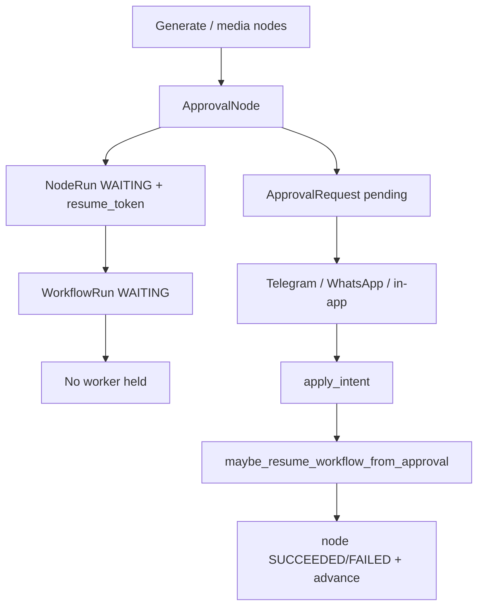

# Approvals

Human review before publishing. Workflow **Approval** nodes pause runs without holding Celery workers.

## Product principles

* Approval-first: AI prepares; operators decide.
* Channel delivery (Telegram / WhatsApp / in-app) stays in `ApprovalService` — not baked into workflow graphs.
* Workflow-bound approvals do **not** auto-publish; `PublishNode` owns publish.

## Standalone approval flow

Existing content jobs still use `/approvals/*`, operator actions, and messaging webhooks. HMAC validation + webhook dedupe remain in the approvals module.

## Workflow pause / resume

Binding stored on `ApprovalRequest.response_payload_json["workflow"]`:

* `resume_token`, run/node ids, `on_timeout`, channel metadata

### Outcomes

| Outcome | Node | Typical run |
|---------|------|-------------|
| `approved` | SUCCEEDED | unlock → publish |
| `rejected` | FAILED | FAILED |
| `expired` + `stop` | FAILED | FAILED |
| `expired` + `continue` | SUCCEEDED (timed out) | advance |

API: `POST /api/v1/workflows/resume` with `{resume_token, outcome, decision?, advance?}`.

Dry-run: `simulate_approval` auto-approves WAITING approval nodes.

## Security

* Signed/validated messaging callbacks.
* Webhook deduplication.
* Audit: `approvals.decision` (+ existing callback failure audits).

## Related

* [workflows-phase6-approval-resume.md](workflows-phase6-approval-resume.md)
* [workflow-engine.md](workflow-engine.md)
* [workflows-phase17-security.md](workflows-phase17-security.md)
