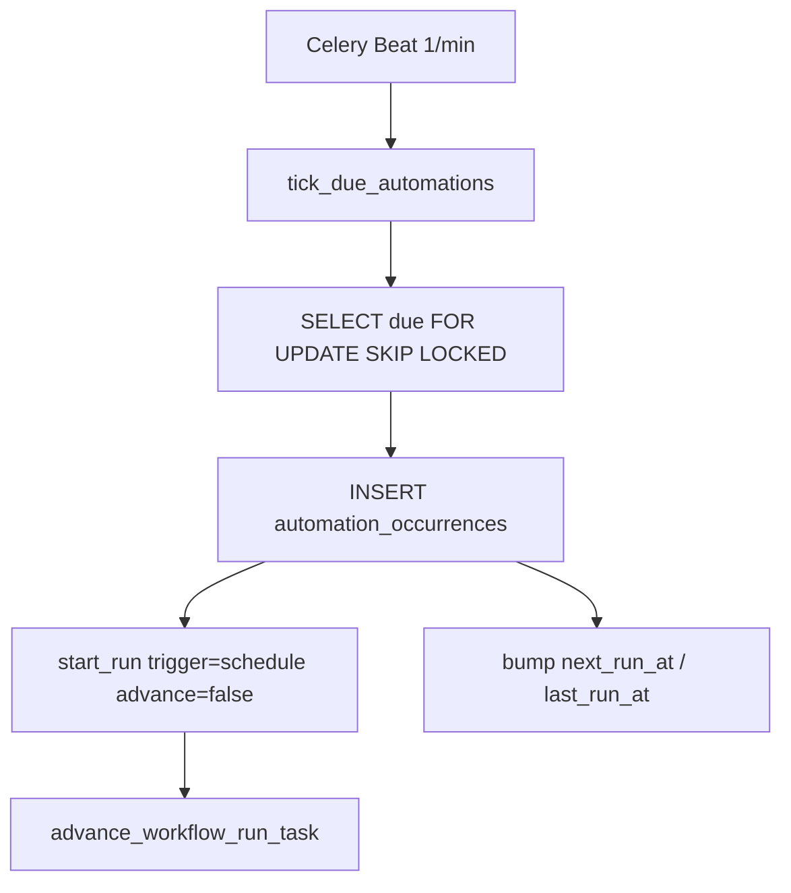

# Automations

An **Automation** binds a published workflow version to a brand, trigger, settings, and one or more social-account targets.

## Model

```text
Automation
  workflow_definition_id / workflow_version_id
  brand_id?
  trigger_type + trigger_config + timezone
  settings JSON (editorial / config / node_overrides)
  enabled, next_run_at, last_run_at
    └── AutomationTarget[]
          social_account_id
          overrides_json
          enabled
```

Same definition → many automations (different brands, schedules, accounts).

## Trigger types

| Type | Behavior |
|------|----------|
| `manual` | Operator / API `start_run` |
| `schedule` | DB scheduler (below) |
| `webhook` / `event` | Reserved; resume stays on auth paths for now |

### Schedule `trigger_config`

| kind | Fields |
|------|--------|
| `interval` | `every_seconds` (≥ 60) |
| `daily` | `at` (`HH:MM`) |
| `weekly` | `days` (`mon`…`sun`), `at` |
| `cron` | `expr` (croniter) |

Timezone = IANA on `Automation.timezone`; `next_run_at` stored UTC.

## Scheduler

Celery Beat runs **one** tick/minute — no per-automation Beat entries.



Idempotency: unique `(automation_id, scheduled_occurrence)` + correlation `sched:{automation_id}:{occurrence_key}`.

## API / UI

* `GET/POST /workflows/automations`
* `PATCH /workflows/automations/{id}` (enable, settings, targets)
* UI: `/dashboard/automations`

Creating an automation does not require enabling it — enable when schedule/targets are ready.

## Authorization

* Mutations need `content:write` + tenant membership.
* Target account IDs must belong to the tenant (`authorize_social_account_ids`).
* Settings/trigger JSON sanitized (no raw secrets).

## Related

* [workflows.md](workflows.md)
* [workflows-phase7-scheduler.md](workflows-phase7-scheduler.md)
* [social-accounts.md](social-accounts.md)
