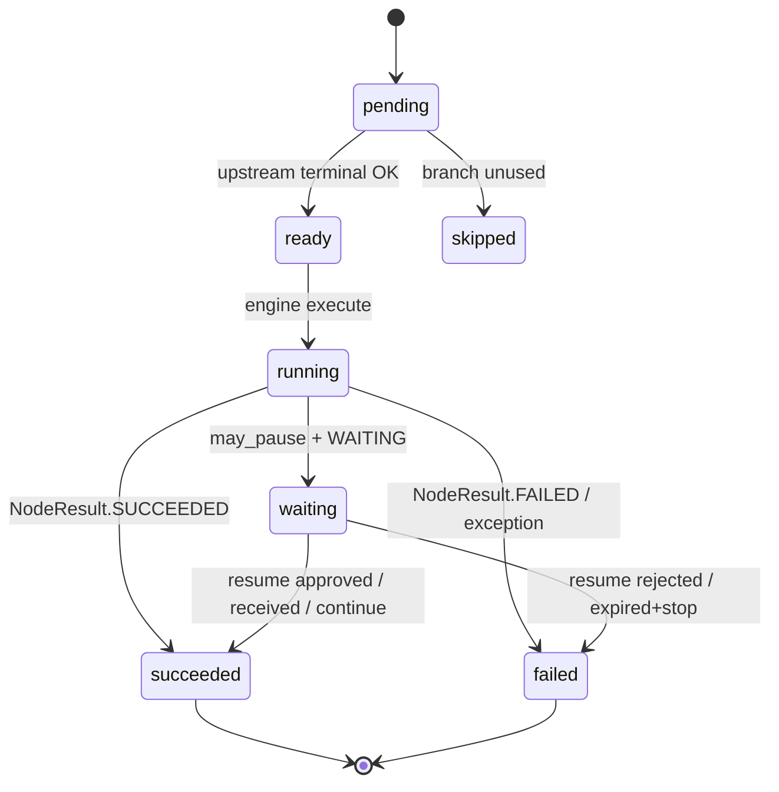

# Workflow nodes

Typed adapters registered in `WorkflowNodeRegistry`. Nodes call domain services; they do not reimplement LLM, media, approval, or publish logic.

## Contract

```python
class WorkflowNode:
    type: str
    version: int
    ConfigSchema / InputSchema / OutputSchema  # Pydantic
    required_capabilities: list[str]
    may_pause: bool

    async def execute(context, inputs, config) -> NodeResult:
        ...
```

`NodeResult.status`: `succeeded` | `failed` | `waiting` | `skipped`.

Metadata (ports, schemas, category) exposed via `GET /workflows/nodes`.

## Lifecycle



Rules:

* Engine bumps `attempt` each enter of `running`.
* `SUCCEEDED` / `WAITING` nodes are not re-executed unless manually reset for retry.
* Pause nodes mint `resume_token` before execute so bindings can stamp it.

## Catalog (implemented)

| Type | Category | Wraps |
|------|----------|--------|
| `manual_trigger` | triggers | Pass-through payload |
| `schedule_trigger` | triggers | Marker (scheduler owns fire) |
| `generate_text` / `summarize` / `generate_script` | AI | Inference / video script providers |
| `fact_review` | AI | `FactRiskReviewService` |
| `generate_image` | media | `ImageGenerationService` |
| `generate_tts` | media | `TTSService` |
| `generate_video` | media | `video_pipeline` |
| `generate_chess_video` | media | `ChessVideoService` |
| `approval` | human | `ApprovalService` → WAITING |
| `condition` / `fan_out` / `merge` / `delay` / `wait` | control | Engine control-flow |
| `platform_transform` | distribution | Canonical → per-platform variants |
| `publish` | distribution | `PublishingService.publish_now` (dry-run default) |
| `fetch_metrics` | analytics | Analytics adapters |

Stubs raise `WorkflowNodeNotImplementedError` until filled.

## Ports and capabilities

Compiler checks:

* edge endpoints exist, no cycles (unless later allowed)
* port/type compatibility (best-effort)
* `required_capabilities` ⊆ union of selected account capability tags
* publish targets present when required
* approval placement semantics

Capability tags include `llm`, `publish`, `image`, `video`, `tts`, `chess`, …

## Config at runtime

Resolved config comes from `WorkflowRun.context_snapshot.resolved_node_configs[node_id]` — not live brand/automation edits. See [workflow-engine.md](workflow-engine.md) and phase 8 notes.

## Frontend

Palette categories mirror registry metadata. Canvas edits the same `nodes`/`edges` JSON as the vertical step editor.
