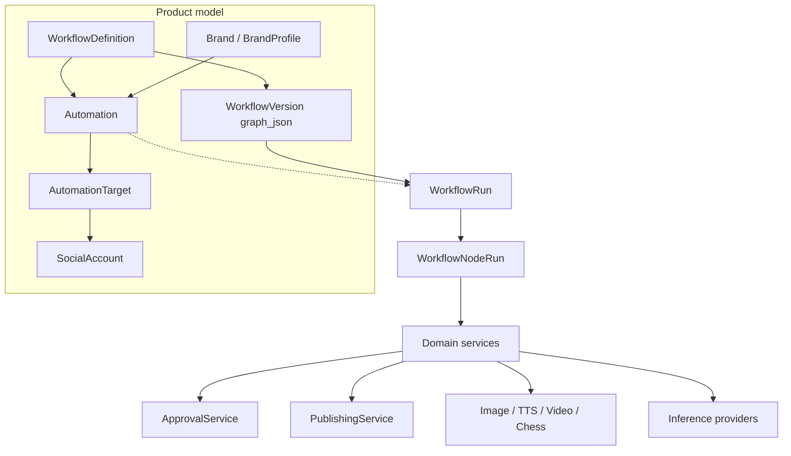

# Workflows

Reusable, versioned DAGs that orchestrate existing SignalForge domain services across brands and social accounts.

Phase notes: [`workflows-phase1-domain.md`](workflows-phase1-domain.md) … [`workflows-phase18-testing.md`](workflows-phase18-testing.md).

## Core idea

```text
Brand / Scope
+ WorkflowDefinition (versioned graph)
+ SocialAccounts (targets)
+ Automation (schedule / trigger / overrides)
        ↓
   WorkflowRun + WorkflowNodeRun
        ↓
   Generated assets → Approval → Publishing jobs → Analytics
```

Do **not** hardcode per-account pipelines (`chess_twitter_flow`, …). Bind one definition to many automations.

## Architecture



| Layer | Role |
|-------|------|
| PostgreSQL | Durable definitions, versions, runs, node runs, occurrences |
| Celery | Node/worker I/O + 1/min scheduler tick — **not** the product workflow model |
| Engine | In-process advance over READY nodes; WAITING releases workers |
| Nodes | Thin adapters (`WorkflowNode`) over domain services |

## Concepts

| Entity | Meaning |
|--------|---------|
| `WorkflowDefinition` | Named template (`draft` / `active` / `archived`) |
| `WorkflowVersion` | Immutable published `graph_json` + checksum |
| `Automation` | Definition + brand + trigger + settings |
| `AutomationTarget` | Destination `social_account_id` + overrides |
| `WorkflowRun` | One execution; freezes config snapshot |
| `WorkflowNodeRun` | Per-node status, I/O, attempts, `resume_token` |

## UI routes

| Path | Page |
|------|------|
| `/dashboard/workflows` | List / create |
| `/dashboard/workflows/:id` | Step + canvas editor |
| `/dashboard/automations` | Bind workflow ↔ brand ↔ schedule ↔ targets |
| `/dashboard/runs` | Run monitor |
| `/dashboard/runs/:id` | Node timeline + resume |

## API (prefix `/api/v1/workflows`)

Definitions, versions, validate/publish, nodes catalog, runs, resume, automations, brands — see OpenAPI `/docs`.

## Related docs

* [workflow-nodes.md](workflow-nodes.md) — catalog + lifecycle
* [workflow-engine.md](workflow-engine.md) — execution, versioning, idempotency, debug
* [automations.md](automations.md) — scheduling + targets
* [workflow-development.md](workflow-development.md) — add nodes / providers
* [approvals.md](approvals.md) — human pause / resume
* [social-accounts.md](social-accounts.md) — accounts + capabilities
* [workflows-phase18-testing.md](workflows-phase18-testing.md) — test matrix
* [phase18-production-grade-testing.md](phase18-production-grade-testing.md) — distributed-system scenarios
* [workflows-phase16-observability.md](workflows-phase16-observability.md) — workflow metrics baseline
* [phase19-observability.md](phase19-observability.md) — Phase 19 metric aliases + hooks
* [workflows-phase17-security.md](workflows-phase17-security.md) — tenant / secrets / audit
* [phase17-webhook-event-triggers.md](phase17-webhook-event-triggers.md) — signed webhook / event triggers
